# FaceApp_Detection_Faciale

Ce projet implémente une application interactive de détection et de manipulation de visages, utilisant des technologies d'intelligence artificielle telles que **OpenCV** et **Streamlit**. Il permet aux utilisateurs de télécharger une image, de détecter des visages et des yeux, et même d'échanger les visages entre eux. Ce projet démontre la capacité à travailler avec des algorithmes de traitement d'images en temps réel et à créer des interfaces utilisateur interactives et intuitives.


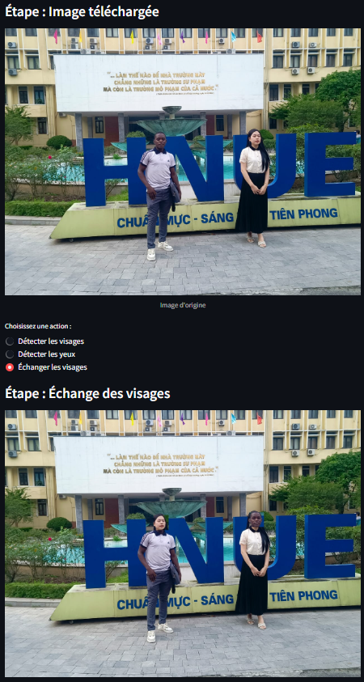
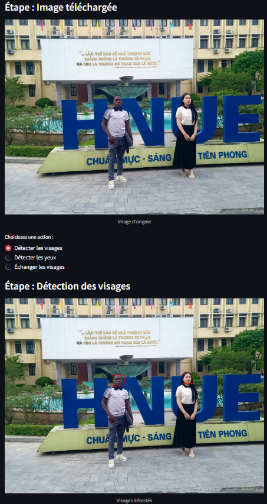


### Fonctionnalités

- **Détection de visages** : Identifie et marque les visages dans l'image téléchargée en utilisant un classificateur Haar.
- **Détection des yeux** : Localise et marque les yeux dans l'image téléchargée.
- **Échange de visages** : Permet d'échanger les visages de deux personnes dans une même image, avec des techniques d'optimisation pour un rendu réaliste.
- **Interface Streamlit** : Interface interactive permettant aux utilisateurs de télécharger une image et d'interagir avec l'application via une interface web simple.

### Technologies utilisées

- **OpenCV** : Bibliothèque de vision par ordinateur pour le traitement d'images et la détection d'objets.
- **Streamlit** : Framework Python que nous avons utilisé pour créer des applications web interactives pour la science des données.
- **NumPy** : Nous a permis à la manipulation de matrices et d'images en Python.
- **PIL (Pillow)** : Pour la gestion des images dans les formats standard comme JPG, PNG, etc.

## Objectifs du projet

Ce projet a pour objectif de démontrer l'utilisation de l'intelligence artificielle et du traitement d'images dans des applications interactives. En plus des fonctionnalités de base, il a été conçu pour être facilement extensible avec de nouvelles fonctionnalités comme la détection de plusieurs visages, la reconnaissance faciale, ou des effets avancés sur les visages.

### Pourquoi ce projet est pertinent

- **Compétences en vision par ordinateur** : Ce projet met en pratique des techniques classiques de vision par ordinateur pour la détection d'objets et la manipulation d'images.
- **Interface interactive** : L'utilisation de Streamlit permet de créer une interface simple mais puissante, idéale pour la démonstration des résultats d'algorithmes de manière visuelle.
- **Adaptabilité** : Le projet est facilement modifiable pour intégrer des algorithmes plus avancés.

## Installation et Exécution

### Prérequis

Assurez-vous que vous avez Python 3.10 ou supérieur installé, ainsi que les dépendances suivantes :

```bash
pip install opencv-python-headless streamlit numpy pillow
```

### Cloner le repository

Clonez ce repository sur votre machine locale :

```bash
git clone https://github.com/votre-utilisateur/detection-manipulation-visages.git
```

### Exécution du projet

1. Ouvrez un terminal ou une invite de commande.
2. Accédez au dossier du projet cloné.
3. Lancez l'application Streamlit :

```bash
streamlit run apps.py
```

Cela ouvrira automatiquement une interface web dans votre navigateur où vous pourrez télécharger une image et interagir avec les fonctionnalités proposées.

## Améliorations possibles

- **Reconnaissance faciale** : Intégration d'un modèle de reconnaissance faciale pour identifier les individus.
- **Échange de visages multiple** : Ajout d'une fonctionnalité permettant d'échanger plusieurs visages dans une même image.
- **Optimisation des performances** : Utilisation de modèles de détection plus rapides ou basés sur des réseaux neuronaux pour de meilleures performances.
- **Amélioration de l'interface utilisateur** : Ajout de plus d'options et de filtres pour les utilisateurs via Streamlit.

## Capture d'écran

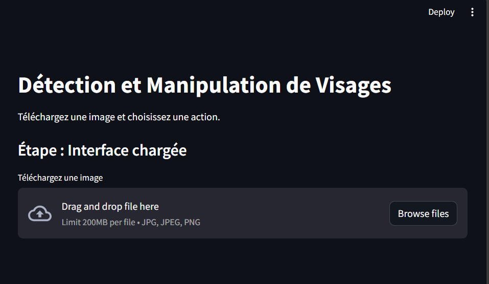
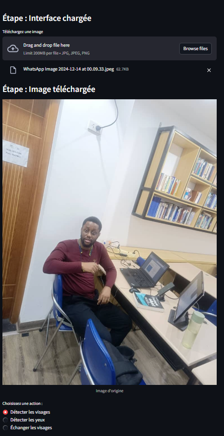
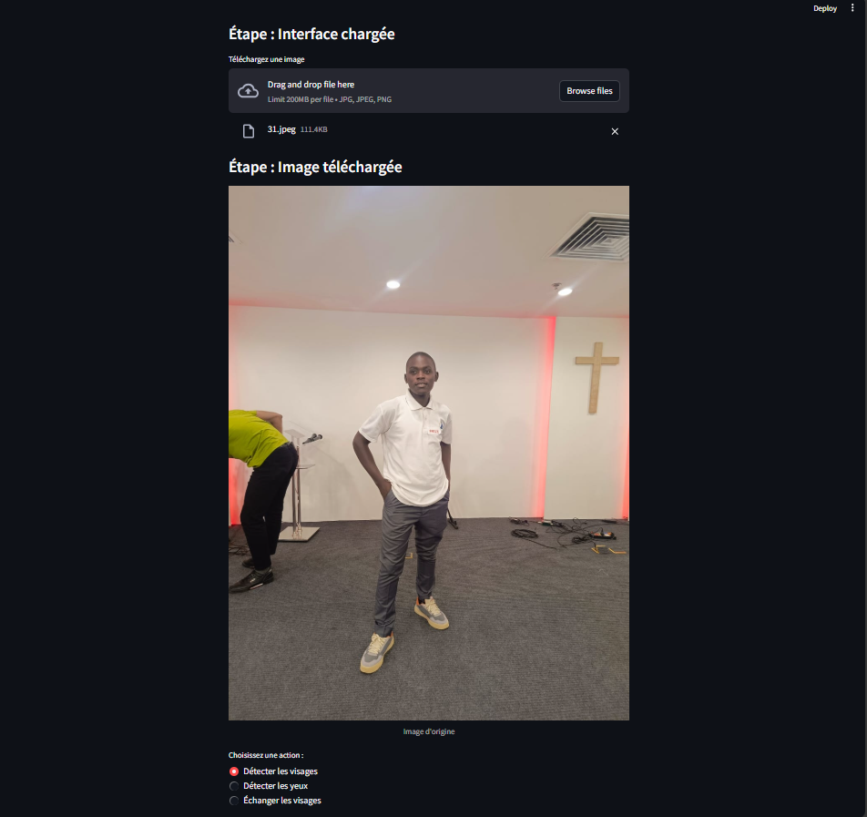
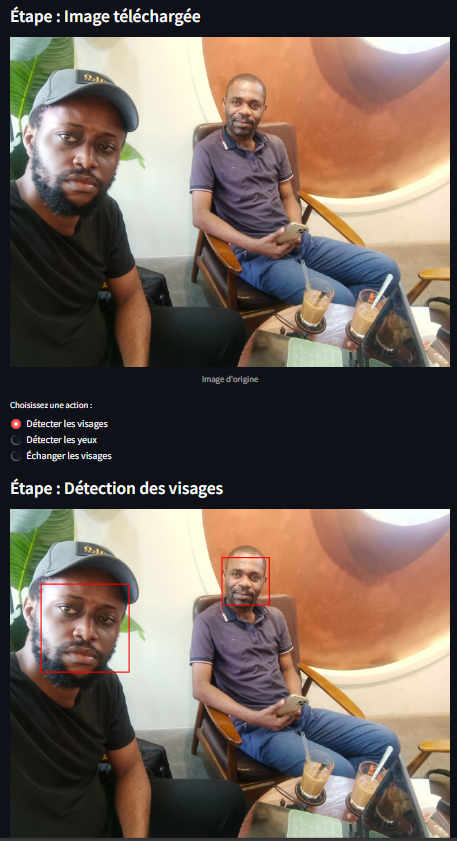
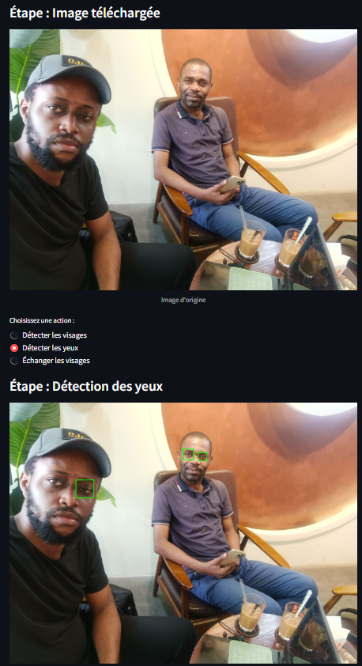
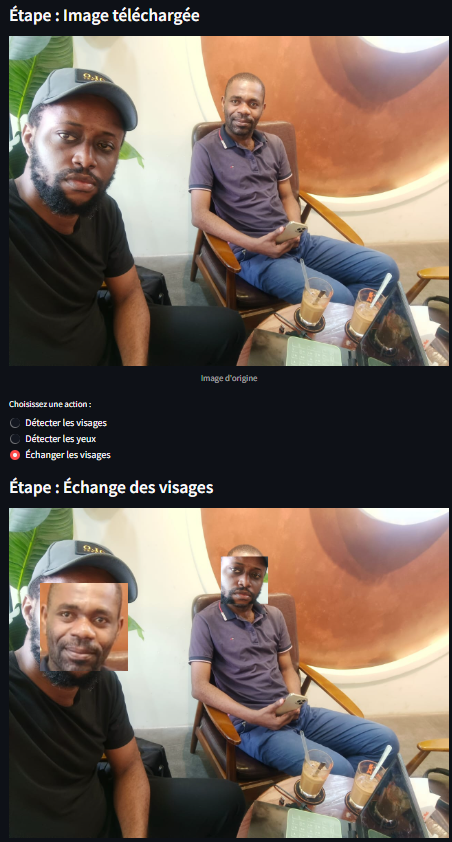
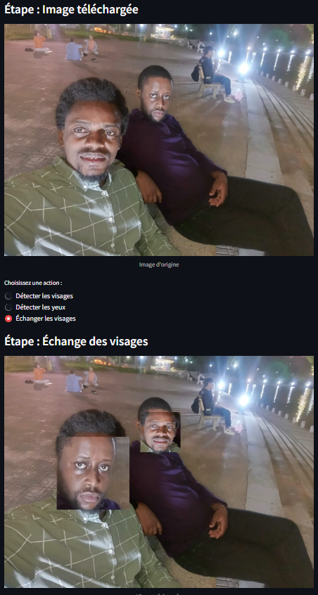
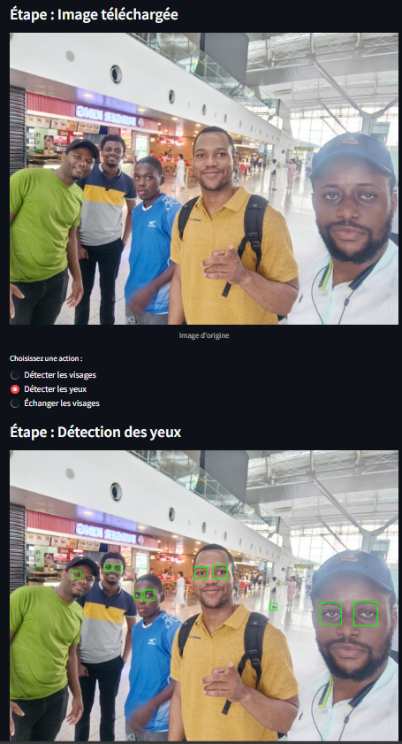
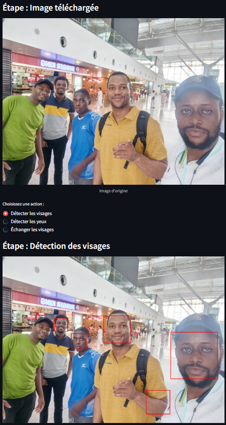
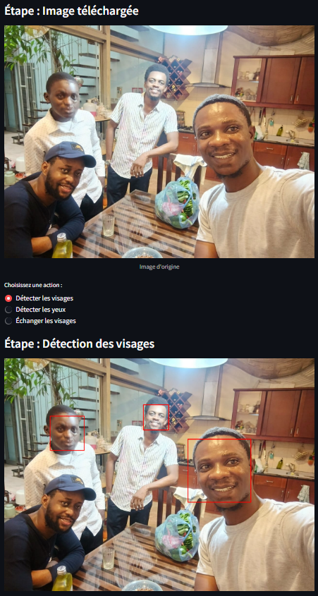

## Auteurs

- **[David Lutala]**

## License

Ce projet est sous licence **MIT** - voir le fichier [LICENSE](LICENSE) pour plus de détails.
